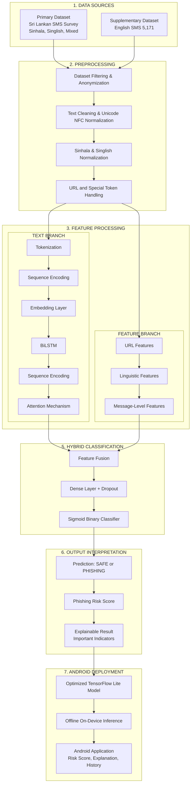

<div align="center">

# 🛡️ NLP-Based Detection of Phishing in Sinhala/Singlish Mobile Messages


**An AI-powered Android application that detects phishing attempts in Sinhala and Singlish (romanized Sinhala) mobile messages using Natural Language Processing.**

[Research Paper](#citation) · [Installation](#installation) · [Architecture](#system-architecture) · [Contributing](CONTRIBUTING.md)

</div>

---

## 📋 Table of Contents

- [Project Overview](#project-overview)
- [Research Motivation](#research-motivation)
- [Research Gap](#research-gap)
- [Objectives](#objectives)
- [System Architecture](#system-architecture)
- [Repository Structure](#repository-structure)
- [Technology Stack](#technology-stack)
- [Installation](#installation)
- [Research Timeline](#research-timeline)
- [Milestone Progress](#milestone-progress)
- [Future Work](#future-work)
- [Contributors](#contributors)
- [License](#license)
- [Citation](#citation)

---

## 🔍 Project Overview

This research project addresses the critical gap in phishing detection for **low-resource South Asian languages**, specifically targeting **Sinhala** (සිංහල) and **Singlish** (romanized Sinhala) text messages on mobile devices.

The project delivers:

1. **ML Engine** (Python) — A complete NLP pipeline for dataset processing, feature engineering, model training, and evaluation.
2. **Android Application** (Kotlin) — An on-device phishing detection app using TensorFlow Lite for offline inference.

### Key Features

- 🌐 **Multilingual Support**: Handles native Sinhala Unicode, Singlish (Latin script), and code-switched messages
- 📱 **Offline Detection**: On-device TFLite inference — no internet required
- ⚡ **Real-Time Analysis**: Sub-50ms inference on modern Android devices
- 📊 **Risk Scoring**: Granular risk assessment with confidence scores
- 📜 **Detection History**: Persistent local history with filtering and export
- 🔒 **Privacy-First**: All processing happens on-device; no data leaves the phone

---

## 🎯 Research Motivation

Sri Lanka has seen a significant increase in SMS-based phishing attacks targeting mobile users. These attacks frequently use:

- **Sinhala text** to impersonate banks, government agencies, and telecom providers
- **Singlish** (romanized Sinhala) which is the dominant informal writing system in Sri Lankan digital communication
- **Code-switching** between Sinhala and English within the same message

Existing phishing detection systems are overwhelmingly designed for English text and fail to handle the linguistic complexities of Sinhala and Singlish.

---

## 🔬 Research Gap

| Dimension | Current State | Our Contribution |
|---|---|---|
| **Language Coverage** | English-dominant phishing detection | First Sinhala/Singlish-specific detector |
| **Script Handling** | Single-script systems | Multi-script (Sinhala Unicode + Latin) |
| **Code-Switching** | Not addressed | Handles mixed Sinhala-English messages |
| **Deployment** | Server-side inference | On-device (offline) via TFLite |
| **SMS Focus** | General web/email phishing | Mobile SMS-specific features |

---

## 🎯 Objectives

1. **Build a labelled dataset** of Sinhala and Singlish phishing/legitimate SMS messages
2. **Develop preprocessing pipelines** for Sinhala Unicode normalisation and Singlish transliteration
3. **Engineer domain-specific features** including URL analysis, urgency detection, and script-ratio metrics
4. **Train and evaluate** hybrid NLP models (BiLSTM + feature-based) for phishing classification
5. **Deploy on Android** as a lightweight TFLite model with offline capability
6. **Publish findings** as a peer-reviewed research paper

---

## 🏗️ System Architecture

The system follows a **7-stage pipeline** from data collection through to on-device Android deployment:



### Pipeline Stages

| Stage | Description | Implementation |
|-------|-------------|----------------|
| **1. Data Sources** | Primary Sri Lankan SMS survey (Sinhala, Singlish, mixed) + supplementary English SMS corpus (5,171 messages) | `dataset/raw/` |
| **2. Preprocessing** | Filtering, anonymization, Unicode NFC normalization, script-specific normalization, URL/special token replacement | `ml-engine/preprocessing/` |
| **3. Feature Processing** | **Text Branch**: Tokenization → Embedding → BiLSTM → Attention. **Feature Branch**: URL features (12-dim) + linguistic features (11-dim) + message-level features | `ml-engine/preprocessing/tokenizer.py`, `ml-engine/features/` |
| **5. Hybrid Classification** | Feature fusion of both branches → Dense + Dropout → Sigmoid binary classifier | `ml-engine/models/` |
| **6. Output Interpretation** | Binary prediction (SAFE/PHISHING), phishing risk score (0.0–1.0), explainable result with important indicators | `ml-engine/predict.py`, `ml-engine/evaluation/` |
| **7. Android Deployment** | Optimized TFLite model, offline on-device inference, Android app with risk score, explanation, and history | `ml-engine/export/`, `app/` |

---

## 📂 Repository Structure

```
sinhala-singlish-phishing-detection/
├── app/                          # Android application (Kotlin)
│   └── src/main/
│       ├── java/.../
│       │   ├── presentation/     # UI layer (Compose screens, ViewModels)
│       │   ├── domain/           # Business logic (use cases, models)
│       │   ├── data/             # Data layer (Room, repositories)
│       │   ├── di/               # Dependency injection (Hilt)
│       │   ├── ml/               # TFLite inference (ModelLoader, Predictor)
│       │   └── utils/            # Shared utilities
│       └── assets/               # TFLite model + tokenizer config
├── ml-engine/                    # ML pipeline (Python)
│   ├── preprocessing/            # Text cleaning, normalisation, tokenisation
│   ├── dataset/                  # Data loading, splitting, annotation
│   ├── features/                 # URL and linguistic feature extraction
│   ├── models/                   # Model architectures
│   ├── training/                 # Training pipeline
│   ├── evaluation/               # Metrics and reporting
│   ├── export/                   # TFLite export
│   └── utils/                    # Logging, configuration
├── dataset/                      # Raw and processed SMS data
│   ├── raw/                      # google_form_sms_dataset.csv, sms_phishing_dataset_v1.csv
│   ├── processed/                # final_sms_phishing_dataset.csv (generated)
│   └── README.md                 # Dataset documentation
├── docs/                         # Research documentation
├── configs/                      # Pipeline configuration (YAML)
├── scripts/                      # merge_datasets.py, preprocess_sample.py
├── notebooks/                    # data_exploration.ipynb
├── tests/                        # Unit tests (Python + Android)
├── .github/                      # CI/CD workflows + templates
├── experiments/                  # Experiment tracking
└── results/                      # Model outputs and reports
```

---

## 🛠️ Technology Stack

### Android Module

| Component | Technology |
|---|---|
| Language | Kotlin 2.0 |
| UI Framework | Jetpack Compose + Material Design 3 |
| Architecture | MVVM + Clean Architecture |
| DI | Hilt (planned) |
| Database | Room |
| Async | Coroutines + Flow |
| ML Inference | TensorFlow Lite |
| Navigation | Navigation Compose |
| Min SDK | API 24 (Android 7.0) |

### ML Engine Module

| Component | Technology |
|---|---|
| Language | Python 3.10 |
| ML Framework | TensorFlow / Keras |
| NLP | Custom tokeniser + feature engineering |
| Data Processing | pandas, NumPy |
| Evaluation | scikit-learn |
| Code Quality | Black, Ruff, MyPy |
| Testing | pytest |
| Security | Bandit, pip-audit |

---

## Installation

### Prerequisites

- **Android Studio** Ladybug or later
- **JDK 21**
- **Python 3.10+**
- **Git**

### Android Studio Setup

```bash
# Clone the repository
git clone https://github.com/vikumkodikara/sinhala-singlish-phishing-detection.git

# Open in Android Studio
# File → Open → select the project root

# Build the project
./gradlew assembleDebug
```

### Python Setup

```bash
# Create virtual environment
python -m venv venv
source venv/bin/activate  # Linux/macOS
venv\Scripts\activate     # Windows

# Install dependencies and the ML engine package
pip install -r requirements.txt
pip install -e .

# Merge raw datasets into a unified processed file
python scripts/merge_datasets.py

# Preview preprocessing on sample messages
python scripts/preprocess_sample.py --limit 5

# Explore dataset in Jupyter
jupyter notebook notebooks/data_exploration.ipynb

# Verify installation
python -c "from ml_engine.preprocessing import preprocess_message; print('OK')"
```

### Dataset

Raw data lives in `dataset/raw/`:

| File | Description |
|------|-------------|
| `google_form_sms_dataset.csv` | Consented Sri Lankan SMS survey responses |
| `sms_phishing_dataset_v1.csv` | Public SMS spam/phishing corpus (5,174 messages) |

Run `python scripts/merge_datasets.py` to produce `dataset/processed/final_sms_phishing_dataset.csv`.
See `dataset/README.md` for schema, ethics, and label mapping details.

---

## 📅 Research Timeline

| Week | Focus Area | Status |
|------|-----------|--------|
| 1 | Repository setup, project architecture | ✅ Complete |
| 2 | Dataset collection and annotation guidelines | 🔄 In Progress |
| 3 | Preprocessing pipeline implementation | 🔄 In Progress |
| 4 | Baseline models (Naive Bayes, SVM) | ⏳ Upcoming |
| 5 | Hybrid deep learning model (BiLSTM + features) | ⏳ Upcoming |
| 6 | Evaluation and ablation studies | ⏳ Upcoming |
| 7 | Android integration and TFLite deployment | ⏳ Upcoming |
| 8 | Research paper writing | ⏳ Upcoming |

---

## ✅ Milestone Progress

### Milestone 2 — Project Structure & Preprocessing *(Current)*

- [x] Public GitHub repository
- [x] Initial project structure
- [x] README.md
- [x] Data preprocessing scripts (`ml-engine/preprocessing/`)
- [x] Dataset merge and preprocess utility scripts (`scripts/`)
- [x] Raw datasets in `dataset/raw/`
- [x] `dataset/README.md`
- [x] requirements.txt
- [x] Initial documentation
- [x] CI/CD pipeline
- [x] Meaningful commit history

### Milestone 3 — Model Training & Evaluation *(Upcoming)*

- [x] Initial dataset collection (survey + SMS corpus)
- [ ] Full Sinhala/Singlish corpus labelling
- [ ] Preprocessing pipeline completion
- [ ] Feature engineering
- [ ] Baseline model training
- [ ] Hybrid model development
- [ ] Evaluation and reporting

### Milestone 4 — Android Integration *(Upcoming)*

- [ ] TFLite model export
- [ ] Android UI implementation
- [ ] On-device inference integration
- [ ] Testing and optimisation
- [ ] Research paper submission

---

## 🔮 Future Work

- **Multilingual expansion**: Extend to Tamil and other South Asian languages
- **Real-time SMS monitoring**: Background service for incoming message scanning
- **Federated learning**: Privacy-preserving model updates without centralised data
- **Explainability**: LIME / SHAP integration for interpretable predictions
- **Browser extension**: Extend detection to mobile browser URLs

---

## 👥 Contributors

| Name | Role |
|------|------|
| Nimantha Vikum Kodikara | Developer |
| Ravindhu Adheedha | Developer |

---

## 📄 License

This project is licensed under the MIT License — see the [LICENSE](LICENSE) file for details.

---

<div align="center">

**Built with ❤️ at Horizon Campus, Sri Lanka**

*This project is part of an undergraduate research programme in Computing.*

</div>
