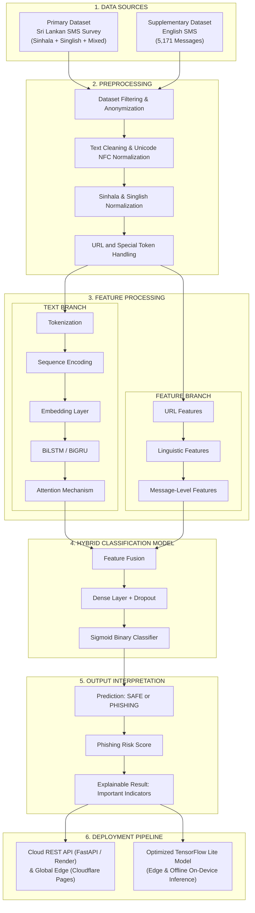

# Sinhala/Singlish Mobile Phishing Detection System

**AI-Assisted Phishing Detection for Sinhala, Singlish, and English Mobile Messages**  
*University Research Project | Natural Language Processing & Deep Learning*

---

## Public Repository and Live Deployments

- **Public GitHub Repository**: [https://github.com/vikumkodikara/sinhala-singlish-phishing-detection](https://github.com/vikumkodikara/sinhala-singlish-phishing-detection)
- **Live Web Application (Frontend)**: [https://sinhala-singlish-phishing-detection.pages.dev](https://sinhala-singlish-phishing-detection.pages.dev/)
- **Live REST API (Backend)**: [https://sinhala-singlish-phishing-detection.onrender.com](https://sinhala-singlish-phishing-detection.onrender.com)
- **Interactive API Documentation (Swagger)**: [https://sinhala-singlish-phishing-detection.onrender.com/docs](https://sinhala-singlish-phishing-detection.onrender.com/docs)

---

## Executive Summary

Mobile SMS phishing (smishing) represents a critical security challenge in Sri Lanka. Attackers systematically exploit the multilingual nature of local communications by alternating between native **Sinhala Unicode script**, phonetic **Singlish** (Sinhala transliterated using the Latin alphabet), and **English** to bypass traditional heuristic keyword filters and rule-based gateways.

This repository provides an end-to-end, production-ready phishing detection system powered by a pre-trained **Bidirectional Gated Recurrent Unit (BiGRU) neural network with a custom Attention Mechanism** integrated with **9 domain-engineered handcrafted features**. The solution delivers real-time inference via a containerized FastAPI backend and a responsive cybersecurity dashboard deployed on global edge infrastructure.

## End-to-End System Architecture Pipeline



```
=====================================================================================
                             END-TO-END PIPELINE STAGES
=====================================================================================
1. DATA SOURCES
   [ Primary Dataset: Sri Lankan SMS Survey ] + [ Supplementary Dataset: English SMS ]
                                     │
                                     ▼
2. PREPROCESSING
   [ Dataset Filtering ] -> [ Unicode NFC ] -> [ Sinhala/Singlish Normalization ] -> [ URL & Token Handling ]
                                     │
                  ┌──────────────────┴──────────────────┐
                  ▼                                     ▼
3. FEATURE PROCESSING (Text Branch)     3. FEATURE PROCESSING (Feature Branch)
   [ Tokenization & Sequence Encoding ]   [ URL Features (Count, Length, Subdomains) ]
   [ Embedding Layer (8909 -> 128) ]     [ Linguistic Features (Digits, Punctuation) ]
   [ Bidirectional GRU (64 units) ]      [ Message-Level Features (Suspicious Words) ]
   [ Attention Mechanism Layer ]                        │
                  │                                     │
                  └──────────────────┬──────────────────┘
                                     ▼
4. HYBRID CLASSIFICATION MODEL
   [ Feature Fusion Concatenation ] -> [ Dense Layers (64, 32) + Dropout ] -> [ Sigmoid Classifier ]
                                     │
                                     ▼
5. OUTPUT INTERPRETATION
   [ Prediction: SAFE / PHISHING ] -> [ Risk Score % ] -> [ Explainable Feature Breakdown ]
                                     │
                                     ▼
6. DEPLOYMENT PIPELINE
   [ Cloud REST API (FastAPI / Render) + Web UI (Cloudflare Pages) ]
   [ Optimized TensorFlow Lite Export (Edge / Offline Inference) ]
=====================================================================================
```

---

## Current Project State and Milestones

- [x] **Data Preprocessing & Cleaning Pipeline**: Fully implemented scripts for Unicode normalization, number-preserving character reduction, script identification, and feature extraction.
- [x] **Model Architecture & Serialization**: Pre-trained multi-input BiGRU + Attention network serialized with vocabulary (`tokenizer.json`), scaling weights (`feature_scaler.json`), and class definitions (`labels.json`).
- [x] **RESTful Backend Engine**: High-performance asynchronous FastAPI server providing automated health checks, validation schemas, and real-time model inference.
- [x] **Web User Interface**: Dark-mode, responsive analytical dashboard built with React 18, TypeScript, and Vite.
- [x] **Automated Testing Suite**: Complete unit and integration test suite with 24 passing tests covering data normalization, feature extraction, API contract verification, and model safety constraints.
- [x] **Cloud Production Deployment**: Frontend deployed globally on Cloudflare Pages and backend containerized and deployed on Render Cloud.
- [x] **Repository Environment Configuration**: Standardized `requirements.txt`, `pyproject.toml`, `.env.example`, Docker configurations, and Render blueprints.

---

## Research Motivation and Objectives

1. **Multilingual and Code-Mixed Smishing**: Attackers frequently mix languages within a single message (e.g., *"Oyage account eka block wela, verify karanna http://..."*). Standard monolingual models fail to capture cross-lingual context.
2. **Context-Aware Sequence Modeling**: BiGRU networks capture bidirectional contextual dependencies across character sequences and subword tokens, enabling robust semantic understanding despite irregular spelling.
3. **Hybrid Feature Fusion**: Incorporating structural URL indicators (subdomain counts, URL length) with linguistic risk markers (financial keywords, punctuation intensity) provides strong domain context complementary to neural text embeddings.
4. **Explainable AI for End-Users**: Beyond a binary classification, the system returns feature-level breakdowns and confidence scores to explain why a message was flagged.

---

## Data Preprocessing Pipeline

The preprocessing module (`backend/app/services/preprocessing.py` and `ml-engine/preprocessing/`) standardizes incoming text inputs before inference:

```
Raw Message -> Unicode NFC -> Whitespace Normalization -> Number Preservation -> Tokenization -> Padding
```

1. **Unicode NFC Normalization**: Normalizes composite Sinhala characters and vowel modifiers into canonical form using `unicodedata.normalize("NFC", text)`.
2. **Whitespace Normalization**: Collapses irregular tabs, line breaks, and repeated spacing into single spaces.
3. **Number-Preserving Character Normalization**: Repeated characters in words are collapsed to a maximum of 3 instances (e.g., `pleeease` from `pleeeeeeeease`), while numeric sequences (`Rs. 25000`, `OTP: 849201`, account numbers) are preserved to prevent data distortion using regex `([^\d\s])\1{3,}`.
4. **Script Detection**: Classifies the input into `SINHALA`, `SINGLISH`, `ENGLISH`, or `MIXED` based on character code ranges.
5. **Sequence Tokenization & Padding**: Converts normalized text into integer index sequences based on the 8,908-token research vocabulary, truncated or post-padded to a fixed sequence length of 120 tokens.

---

## Handcrafted Domain Features

The hybrid model extracts 9 domain-specific numerical features, standardized at runtime using pre-computed `StandardScaler` parameters:

| Feature Name | Type | Description |
|---|---|---|
| `url_count` | Integer | Total number of URLs matching `https?://\S+|www\.\S+` |
| `url_length` | Integer | Character length of the longest embedded URL |
| `subdomain_count` | Integer | Count of subdomains within the extracted host |
| `digit_count` | Integer | Total numeric digits contained in the text |
| `exclamation_count`| Integer | Frequency of exclamation marks (`!`) |
| `question_count` | Integer | Frequency of question marks (`?`) |
| `text_length` | Integer | Total character count of the normalized text |
| `word_count` | Integer | Total word count |
| `suspicious_word_count`| Integer | Matches against financial and urgency keyword dictionaries (`otp`, `verify`, `account`, `bank`, `password`, `urgent`, `winner`, `prize`, etc.) |

*Security Guarantee: All URL feature analysis is performed purely via static regular expression parsing. No external network connections, HTTP requests, or DNS lookups are initiated during extraction.*

---

## Machine Learning Architecture

The model (`Sinhala_Singlish_Phishing_BiGRU_Model`) is a multi-input deep neural network combining sequence modeling with structured feature dense layers:

```
[ Text Input: (None, 120) ]         [ Feature Input: (None, 9) ]
             │                                   │
   [ Embedding Layer ]                 [ StandardScaler ]
      (8909 -> 128)                              │
             │                         [ Dense Layer (32, ReLU) ]
[ Bidirectional GRU (64 units) ]                 │
             │                                   │
[ Attention Mechanism Layer ]                    │
             │                                   │
             └───────────────┬───────────────────┘
                             │
                  [ Concatenate Fusion ]
                      (None, 160)
                             │
               [ Dense Layer (64, ReLU) ]
                  [ Dropout Rate: 0.3 ]
                             │
               [ Dense Layer (32, ReLU) ]
                  [ Dropout Rate: 0.2 ]
                             │
              [ Output: Dense (1, Sigmoid) ]
```

### Model Specifications

- **Total Parameters**: 3,683,501 (14.05 MB)
- **Trainable Parameters**: 1,227,833 (4.68 MB)
- **Vocabulary Size**: 8,908 tokens
- **Maximum Sequence Length**: 120
- **Decision Threshold**: 0.50

---

## Empirical Benchmark Results

### 1. Synthetic-Heavy Random-Split Benchmark (Held-out Test Set, N=1,344)

- **Accuracy**: 100.0%
- **Precision**: 100.0%
- **Recall**: 100.0%
- **F1-Score**: 100.0%
- **ROC-AUC**: 1.0000
- **Confusion Matrix**: True Negative = 327, False Positive = 0, False Negative = 0, True Positive = 1,017

### 2. Real-World Authentic Message Holdout Audit (N=28 Authentic Sri Lankan Messages)

- **Accuracy**: 92.86%
- **Precision**: 100.0%
- **Recall**: 92.31%
- **F1-Score**: 96.00%
- **ROC-AUC**: 0.9808
- **Confusion Matrix**:
  - `SAFE`: 2 correctly identified, 0 false alarms
  - `PHISHING`: 24 correctly identified, 2 false negatives

*Scientific Transparency Note: The real-message audit represents an exploratory holdout evaluation on authentic observations. Results are provided for academic rigor and model explainability.*

---

## Project Folder Structure

```
sinhala-singlish-phishing-detection/
│
├── .github/
│   ├── workflows/
│   │   ├── python-ci.yml                # CI workflow for automated linting and test execution
│   │   ├── release.yml                  # Release asset build pipeline
│   │   └── security.yml                 # Bandit and dependency vulnerability scans
│   └── ISSUE_TEMPLATE/                  # Standardized issue templates
│
├── backend/
│   ├── app/
│   │   ├── __init__.py
│   │   ├── main.py                      # FastAPI application entry point, lifespan, and CORS
│   │   ├── api/
│   │   │   ├── __init__.py
│   │   │   └── routes.py                # Endpoints (/health, /api/v1/predict, /api/v1/model-info)
│   │   ├── schemas/
│   │   │   ├── __init__.py
│   │   │   └── prediction.py            # Pydantic request/response validation schemas
│   │   ├── services/
│   │   │   ├── __init__.py
│   │   │   ├── model_service.py         # Singleton Keras model loader and custom AttentionLayer
│   │   │   ├── preprocessing.py         # Text cleaning and tokenization logic
│   │   │   └── feature_extraction.py    # 9 handcrafted feature extractors
│   │   └── utils/
│   │       ├── __init__.py
│   │       └── logger.py                # Security-conscious structured logging
│   ├── models/
│   │   ├── phishing_model.keras         # Serialized research deep learning model
│   │   ├── tokenizer.json               # Word index vocabulary mapping
│   │   ├── feature_scaler.json          # StandardScaler mean and scale vectors
│   │   └── labels.json                  # Class mappings and decision threshold
│   ├── tests/
│   │   ├── __init__.py
│   │   ├── test_api.py                  # API route and integration tests
│   │   ├── test_preprocessing.py        # Text normalization and tokenization tests
│   │   └── test_feature_extraction.py   # Handcrafted feature extraction tests
│   ├── Dockerfile                       # Multi-stage container build definition
│   └── requirements.txt                 # Backend-specific Python requirements
│
├── frontend/
│   ├── public/                          # Static web assets
│   ├── src/
│   │   ├── components/
│   │   │   ├── Header.tsx               # Navigation bar and system health badge
│   │   │   ├── MessageAnalyzer.tsx      # Main message submission interface
│   │   │   ├── PredictionResultCard.tsx # Threat verdict card, confidence meter, risk level
│   │   │   ├── FeatureBreakdown.tsx     # 9 Handcrafted features inspection table
│   │   │   ├── SampleMessages.tsx       # Curated multilingual evaluation test samples
│   │   │   ├── ResearchResultsView.tsx  # Interactive research metrics and confusion matrices
│   │   │   ├── ArchitectureView.tsx     # Neural graph and layer architecture documentation
│   │   │   └── SecurityAdvisory.tsx     # Privacy policy and safe isolation notice
│   │   ├── styles/
│   │   │   └── index.css                # Custom CSS design system tokens
│   │   ├── types.ts                     # TypeScript data contracts
│   │   ├── App.tsx                      # Root application component
│   │   └── main.tsx                     # React application entry point
│   ├── package.json                     # Frontend npm dependencies
│   ├── tsconfig.json                    # TypeScript compiler options
│   ├── vite.config.ts                   # Vite build configuration
│   ├── nginx.conf                       # Production Nginx reverse proxy configuration
│   └── Dockerfile                       # Production frontend container definition
│
├── dataset/
│   ├── processed/                       # Processed evaluation and training splits
│   └── raw/                             # Master raw dataset records
│
├── ml-engine/
│   ├── dataset/                         # Dataset loading and split utilities
│   ├── evaluation/                      # Offline model evaluation and metrics scripts
│   ├── features/                        # Linguistic and URL feature extraction modules
│   ├── models/                          # Base model interfaces and layer definitions
│   ├── preprocessing/                   # Normalization, tokenization, and cleaning modules
│   ├── training/                        # Model training orchestration scripts
│   └── utils/                           # Configuration and logging helpers
│
├── scripts/
│   ├── deploy_oracle.sh                 # Automated cloud VM deployment script
│   ├── merge_datasets.py                # Dataset consolidation helper
│   ├── preprocess_sample.py             # Preprocessing validation script
│   └── test_model_inference.py          # Standalone model verification script
│
├── docs/
│   ├── Deployment_Plan.md               # Technical deployment architecture
│   ├── Development_Guide.md             # Local environment setup guide
│   ├── Model_Architecture.md            # Detailed neural network specifications
│   ├── Oracle_Deployment_Guide.md       # Oracle Cloud VM and Cloudflare deployment guide
│   └── System_Architecture.md           # End-to-end system design documentation
│
├── docker-compose.yml                   # Multi-service container orchestration
├── render.yaml                          # Render Cloud deployment blueprint
├── wrangler.toml                        # Cloudflare Pages / Workers configuration
├── requirements.txt                     # Root project dependencies
├── pyproject.toml                       # Python project configuration and tools
├── .env.example                         # Environment variables template
├── LICENSE                              # MIT License
└── README.md                            # Comprehensive system documentation
```

---

## Installation and Local Setup

### Prerequisites

- Python 3.10, 3.11, or 3.13
- Node.js 18+ and npm
- Git

### 1. Clone the Repository

```bash
git clone https://github.com/vikumkodikara/sinhala-singlish-phishing-detection.git
cd sinhala-singlish-phishing-detection
```

### 2. Backend Environment Setup

```bash
# Create a virtual environment
python -m venv venv

# Activate virtual environment (Windows)
.\venv\Scripts\Activate.ps1
# On Linux/macOS: source venv/bin/activate

# Install dependencies
pip install --upgrade pip
pip install -r backend/requirements.txt

# Run automated validation test
python -m pytest backend/tests/ -v

# Start FastAPI server
uvicorn backend.app.main:app --host 0.0.0.0 --port 8000 --reload
```

The backend API will be active at `http://localhost:8000` with Swagger documentation at `http://localhost:8000/docs`.

### 3. Frontend Setup

```bash
cd frontend

# Install dependencies
npm install

# Start local development server
npm run dev
```

The web dashboard will be available at `http://localhost:3000`.

---

## Docker Deployment

To launch the full application stack locally using Docker Compose:

```bash
# Build and run containers in detached mode
docker compose up -d --build

# Verify container status
docker compose ps

# View backend logs
docker compose logs -f backend
```

---

## API Reference

### Health Check Endpoint
```http
GET /health
```
**Response (`200 OK`)**:
```json
{
  "status": "healthy",
  "model_loaded": true,
  "model_name": "Sinhala_Singlish_Phishing_BiGRU_Model",
  "version": "1.0.0",
  "vocab_size": 8908,
  "max_sequence_length": 120,
  "num_features": 9
}
```

### Phishing Prediction Endpoint
```http
POST /api/v1/predict
Content-Type: application/json

{
  "message": "Oyage Commercial Bank account eka suspend wenawa danma verify karanna http://combank-secure-update.lk/login OTP eka danna."
}
```
**Response (`200 OK`)**:
```json
{
  "prediction": "PHISHING",
  "probability": 0.9982,
  "confidence": 99.82,
  "risk_level": "HIGH",
  "detected_script": "SINGLISH",
  "preprocessed_text": "oyage commercial bank account eka suspend wenawa danma verify karanna http combank secure update lk login otp eka danna",
  "detected_features": {
    "url_count": 1,
    "url_length": 34,
    "subdomain_count": 0,
    "digit_count": 0,
    "exclamation_count": 0,
    "question_count": 0,
    "text_length": 122,
    "word_count": 15,
    "suspicious_word_count": 4
  },
  "warning": null
}
```

### Metadata and Sample Endpoints
- `GET /api/v1/model-info`: Retrieves architectural layers, dataset distributions, and benchmark results.
- `GET /api/v1/samples`: Returns curated test messages across Sinhala, Singlish, and English for immediate evaluation.

---

## Limitations and Future Directions

1. **Recurrent Architecture Edge Export**: The original research goal evaluated on-device mobile inference. Due to custom Attention Layer ops and bidirectional recurrent state mapping constraints in legacy TFLite runtimes, server-side inference is utilized via containerized REST microservices.
2. **Dataset Expansion**: The training corpus incorporates 10,000 synthetic template variations and 40 authentic observations. Ongoing efforts focus on expanding authentic crowd-sourced Sri Lankan SMS datasets.
3. **Transformer Exploration**: Future work will evaluate fine-tuning lightweight multilingual encoders such as Sinhala-BERT and XLM-RoBERTa for enhanced subword semantic modeling.

---

## Authors and Attribution

- **Vikum Kodikara** — Research Contributor
- **Ravindhu Adheesha** — Research Contributor
- **Academic Research Topic**: NLP-Based Detection of Phishing Attacks in Multilingual Sinhala and Singlish Mobile Messages
- **Institution**: University Research Project, Sri Lanka
- **License**: MIT License
