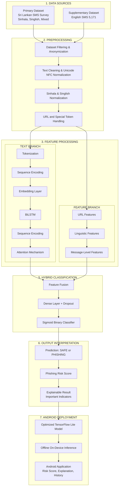

# System Architecture

## Overview

The system follows a **7-stage pipeline architecture** from data collection through to on-device Android deployment. It consists of two primary modules: a Python-based **ML Engine** for model development, and a Kotlin-based **Android Application** for offline on-device inference.

## Architecture Principles

- **Clean Architecture**: Separation of concerns across layers (domain, data, presentation)
- **MVVM Pattern**: Unidirectional data flow in the Android UI
- **Repository Pattern**: Abstracts data sources behind interfaces
- **Offline-First**: All inference happens on-device via TensorFlow Lite
- **Hybrid Model**: Combines deep learning (BiLSTM + Attention) with handcrafted feature engineering

## End-to-End Pipeline



## Pipeline Stage Details

### Stage 1: Data Sources

| Dataset | Description | Location |
|---------|-------------|----------|
| Primary Dataset | Sri Lankan SMS survey responses (Sinhala, Singlish, mixed) | `dataset/raw/google_form_sms_dataset.csv` |
| Supplementary Dataset | Public English SMS spam/phishing corpus (5,171 messages) | `dataset/raw/sms_phishing_dataset_v1.csv` |

### Stage 2: Preprocessing

Sequential text processing pipeline:

1. **Dataset Filtering & Anonymization** — Remove duplicates, anonymize personal data
2. **Text Cleaning & Unicode NFC Normalization** — Strip noise, normalize Unicode (`ml-engine/preprocessing/clean_text.py`)
3. **Sinhala & Singlish Normalization** — Script-specific normalizations (`normalize_sinhala.py`, `normalize_singlish.py`)
4. **URL and Special Token Handling** — Replace URLs, phone numbers, emails with special tokens (`remove_noise.py`)

### Stage 3: Feature Processing

Two parallel branches extract complementary features:

#### Text Branch (Deep Learning)

| Step | Description | Implementation |
|------|-------------|----------------|
| Tokenization | Convert text to token IDs | `ml-engine/preprocessing/tokenizer.py` |
| Sequence Encoding | Pad/truncate to fixed length | `ml-engine/preprocessing/tokenizer.py` |
| Embedding Layer | Map tokens to dense vectors | `ml-engine/models/` |
| BiLSTM | Bidirectional LSTM for contextual encoding | `ml-engine/models/` |
| Attention Mechanism | Weighted focus on phishing-indicative tokens | `ml-engine/models/` |

#### Feature Branch (Handcrafted)

| Feature Group | Dimensions | Implementation |
|---------------|-----------|----------------|
| URL Features | 12 | `ml-engine/features/url_feature_extraction.py` |
| Linguistic Features | 11 | `ml-engine/features/linguistic_features.py` |
| Message-Level Features | Structural metrics (length, word count, etc.) | `ml-engine/features/linguistic_features.py` |

### Stage 5: Hybrid Classification

- **Feature Fusion**: Concatenate attention output from Text Branch with Feature Branch vector
- **Dense Layer + Dropout**: Fully connected layer with dropout for regularization
- **Sigmoid Binary Classifier**: Output probability for PHISHING class

### Stage 6: Output Interpretation

| Output | Description |
|--------|-------------|
| Prediction | Binary classification: `SAFE` or `PHISHING` |
| Phishing Risk Score | Continuous score (0.0–1.0) indicating phishing likelihood |
| Explainable Result | Important indicators highlighting why the message was flagged |

### Stage 7: Android Deployment

| Component | Description | Implementation |
|-----------|-------------|----------------|
| TFLite Model | Float16-quantized model optimized for mobile | `ml-engine/export/export_tflite.py` |
| On-Device Inference | Offline inference engine (~50ms) | `app/.../ml/Predictor.kt` |
| Android Application | Full app with risk score, explanation, and history | `app/.../presentation/` |

## Module Structure

### ML Engine (Python)

```
ml-engine/
├── preprocessing/      ← Text cleaning, normalisation, tokenisation
├── dataset/            ← Data loading, splitting, annotation management
├── features/           ← URL and linguistic feature extraction
├── models/             ← Model architectures (abstract base + implementations)
├── training/           ← Training pipeline orchestrator
├── evaluation/         ← Metrics computation and reporting
├── export/             ← TFLite conversion and validation
├── utils/              ← Logging, configuration management
└── predict.py          ← High-level inference API
```

### Android Application (Kotlin)

```
app/src/main/java/.../
├── presentation/       ← UI (Compose), ViewModels, Navigation
├── domain/             ← Models, Repository interfaces, Use Cases
├── data/               ← Room Database, Repository implementations
├── di/                 ← Hilt dependency injection
├── ml/                 ← TFLite ModelLoader, Predictor, Tokenizer
└── utils/              ← Constants, extensions
```

## Communication Between Modules

The ML Engine and Android Application are connected through **shared artefacts**:

| Artefact | Source | Destination |
|----------|--------|-------------|
| `model.tflite` | `ml-engine/export/` | `app/src/main/assets/` |
| `tokenizer.json` | `ml-engine/preprocessing/` | `app/src/main/assets/` |
| `labels.json` | `ml-engine/evaluation/` | `app/src/main/assets/` |

## Technology Stack

| Layer | Android | ML Engine |
|-------|---------|-----------|
| Language | Kotlin 2.0 | Python 3.10 |
| UI | Jetpack Compose | N/A |
| DI | Hilt | N/A |
| Async | Coroutines + Flow | N/A |
| Database | Room | N/A |
| ML | TensorFlow Lite | TensorFlow / Keras |
| Testing | JUnit, Espresso | pytest |
| CI/CD | GitHub Actions | GitHub Actions |
